<p align="center">
  
    
</p>

<p align="center">

  <a href="https://www.linkedin.com/in/gael-flores-b2b722264/" target="_blank">
    
  </a>

  <a href="mailto:floroandresjob@gmail.com">
    
  </a>

  <a href="https://github.com/Flores-Romero-Andres-Gael">
    
  </a>

  <a href="https://andres-gael-flores-romero.com/">
    
  </a>

</p>

<table align="center" border="0">
  <tr>
    <td valign="top" align="left">
      
    <br align="left">
      
    <br align="left">
      
    </td>
    <td valign="top" align="right">
      
    </td>
  </tr>
</table>

<p align="center">
  
</p>

<h2 align="center"> Tech Stacks </h2>
<p align="center">
  
</p

---
  
<h2 align="center"> About Me </h2>

- 💻 Backend Developer focused on scalable APIs and backend architecture
- ⚙️ Experience with Node.js, Express, TypeScript, Django REST Framework, and MongoDB
- 📱 Frontend development using Angular, React, and Next.js
- 🛠 Building inventory systems, validation workflows, and e-commerce platforms
- 🔍 Passionate about clean architecture, REST APIs, databases, and software design
- 🌱 Currently learning software architecture and advanced backend patterns
- 🎓 Computer Systems Engineering

---

<p align="center">
  
</p>

```bash
gael@backend-dev:~$ whoami
Backend Developer JR

gael@backend-dev:~$ stack
Node.js | TypeScript | Django | Angular | MongoDB
```

<p align="center">
  
</p>
